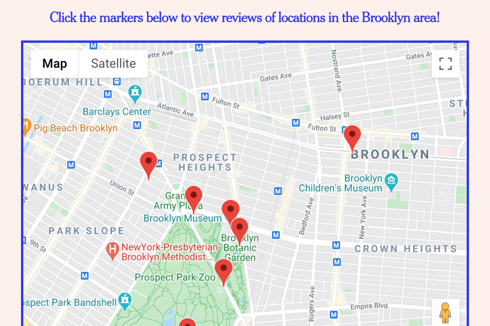
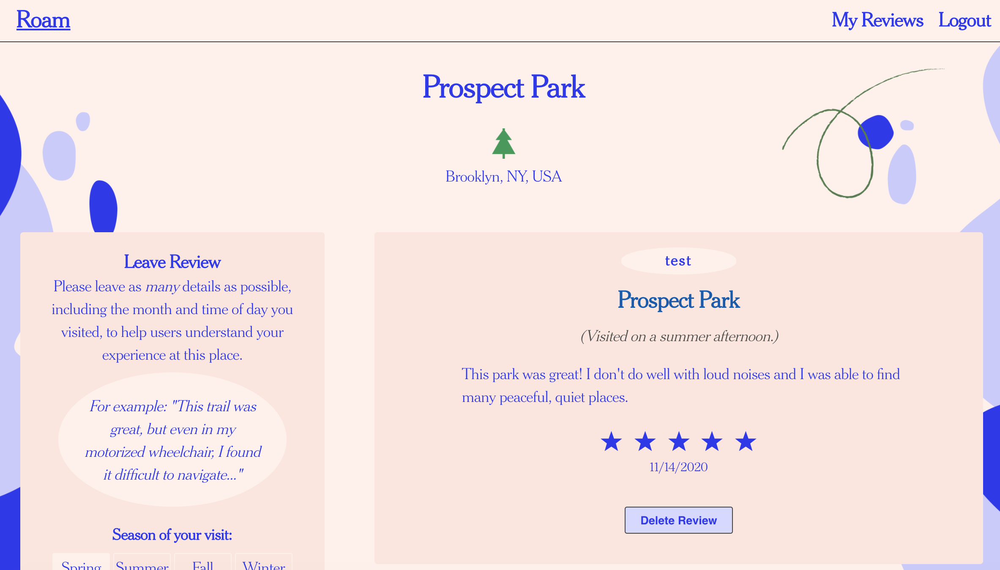
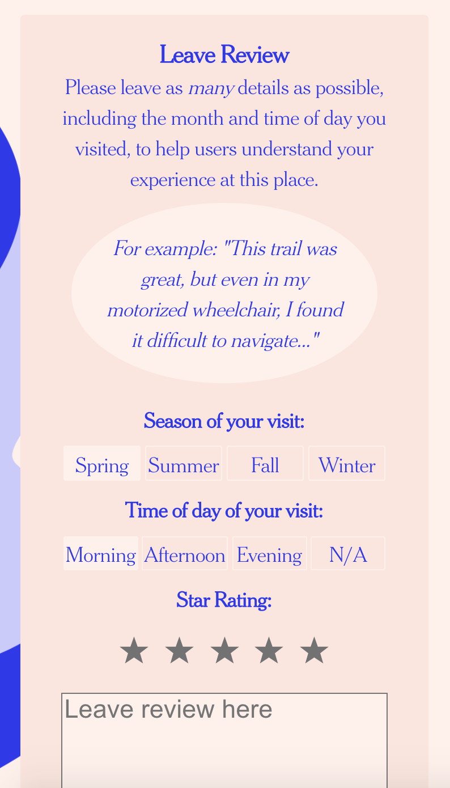
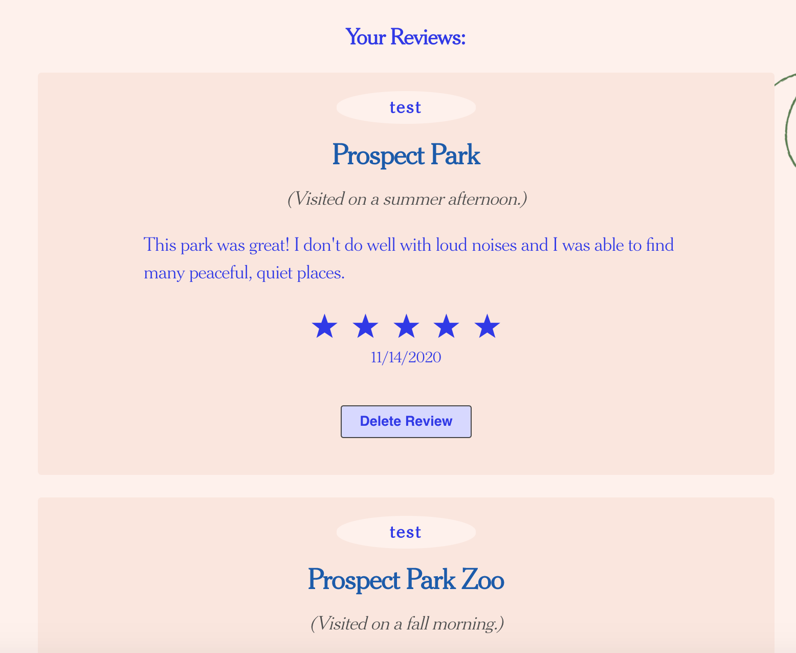

# Roam

[Roam](https://roam.vercel.app/) is here to help disabled people find locations that are accesible for their needs.

https://roam.vercel.app/

## Screenshots

### View locations in your local area

(currently restricted to Brooklyn, NY)

### View reviews of each location, with the option (when logged in) to leave a review of your own.

### View and manage reviews on the "My Reviews" page.

## API Documentation

### Github Repo:

https://github.com/conorkenahan/roam-api

### API Endpoint:

https://blooming-fortress-45366.herokuapp.com/api
